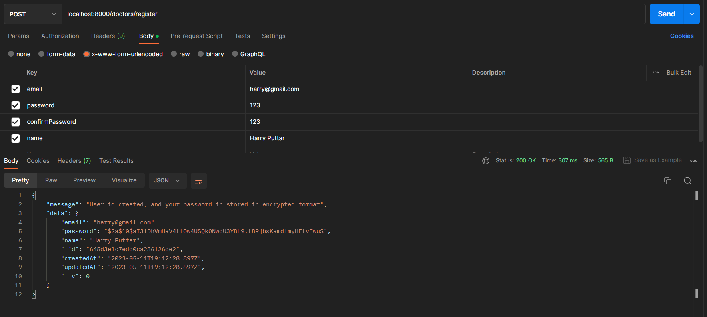
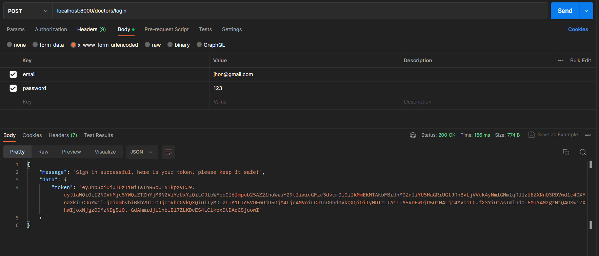
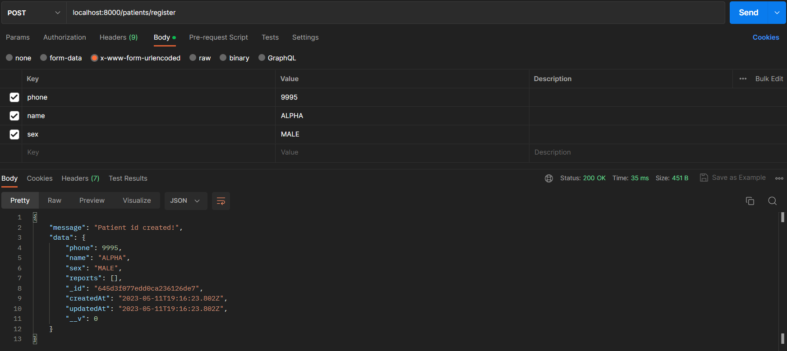
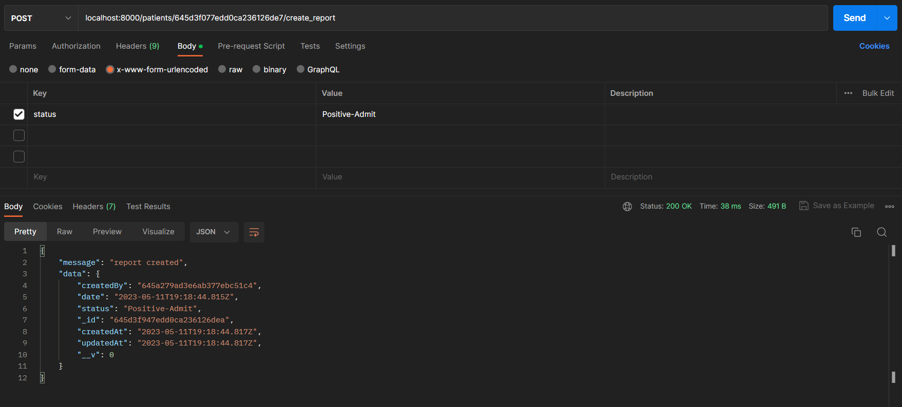
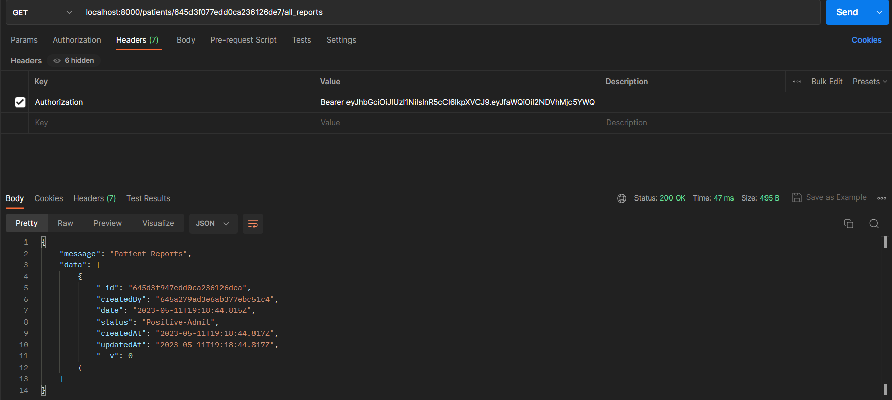
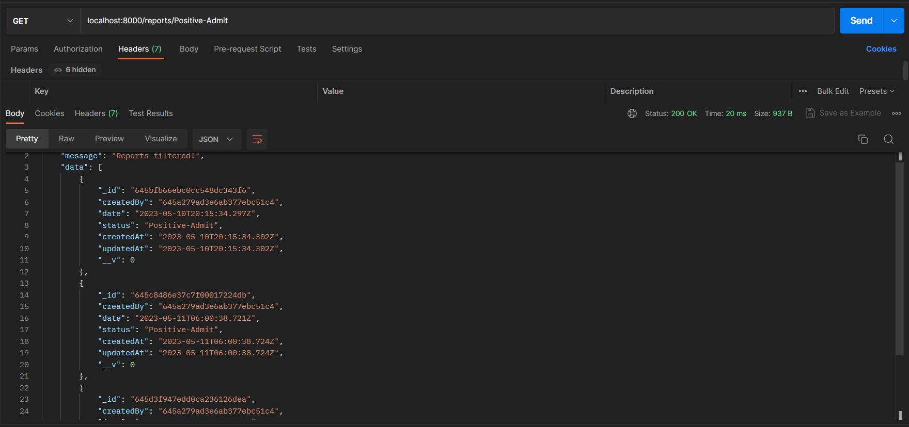

# Click on below link to see a short video on how the Hospital API application works.
https://drive.google.com/file/d/1HPG4wbPpkWtETt2h_NJTPQNFaFhW8RSD/view?usp=share_link

# About repo.

This repo contains the code for building an API's for the doctors of a Hospital which has been allocated by the govt for testing and quarantine + well being of  COVID-19 patients

I have named this application as Hospital_API.

Technology Stack used for this project.
1. Javascript
2. Nodejs
3. Expressjs
4. MongoDB
5. Json web token(JWT)

Major Libraries being used in this project.
1. Passport js
2. Mongoose
3. Bcryptjs.
4. Jsonwebtokens.

Tools Used in this project 
1. Nodejs ( to write backend logic and create express server)
2. Studio 3t ( to view MongoDB document and collection).
3. Postman( to send API calls to the server).

### Routest and its responses defined in this project.

1.	/doctors/register
    - We we make an API call using above path
        - which will use POST method to make the call.
        - It will take 4 inputs: name, email, password & confirm password.
        - On server side a doctor user id will be created if not created and if email id is already present then doctor details will be shared where the password will be in encrypted format.

2.  /doctors/login 
    - We will make an API call using above path
        - which will use POST method to make the call.
        - It will take 2 inputs: email & password.
        - On server side email id and password will be verified and then jwt will be returned which will be required for further authorization

3.  /patients/register 
    - We will make an API call using above path
        - which will use POST method to make the call.
        - It will take 3 inputs: phone, name & sex.
        - This request can be only made by doctor which are already logged in.
        - On server we will check the authentication and if authenticated then a patient user is created.

4.  /patients/:id/create_report
    - We will make an API call using above path
        - which will use POST method to make the call.
        - It will take 1 input: status
        - This request can be only made by doctor which are already logged in.
        - On server we will check the authentication and if authenticated then a report will be created for user id mentioned in the query link(/:id).

5. 	/patients/:id/all_reports 
    - We will make an API call using above path
        - which will use GET method to make the call.
        - This request can be only made by doctor which are already logged in.
        - On server we will check the authentication and if authenticated then all the reports related to patient whom id is mentioned in url link will be shared in sorted fromat(oldest to latest)

6.  /reports/:status  → List all the reports of all the patients filtered by a specific status
    - We will make an API call using above path
        - which will use GET method to make the call.
        - This request can be only made by doctor which are already logged in.
        - On server we will check the authentication and if authenticated then all the reports which have status similar to status mentioned the url link(params) will be shared.

## Images of API calls and its output.
1.	/doctors/register

2.  /doctors/login 

3.  /patients/register

4.  /patients/:id/create_report

5. 	/patients/:id/all_reports 

6.  /reports/:status
